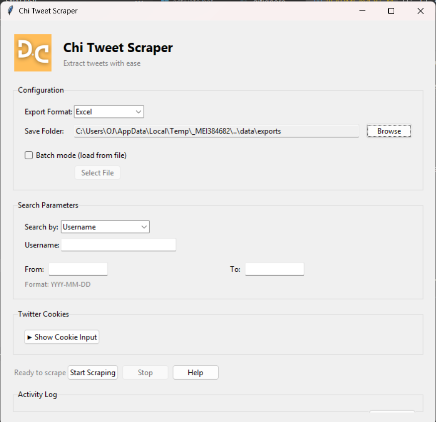

## 🐦 Chi Tweet Scraper

<p align="center">     </p>

Chi Tweet Scraper is a desktop app built with **Python**, **Tkinter**, and **Twikit** that lets you scrape tweets for any username within a chosen date range. It uses a cookie-based login system (via **EditThisCookie**) to stay authenticated, and exports all results into **.xlsx** or **.CSV** files for easy analysis.

---

### ✨ Features

✅ **Simple GUI** – Enter username and a date range directly in the app.
✅ **Secure Login** – Paste cookies from your browser; no passwords are ever stored.
✅ **Export Ready** – Tweets are saved as Excel files in the `/data/exports` directory.
✅ **Multi-User Support** – Scrape tweets from multiple usernames in a single session.
✅ **Cookie Expiration Detection** – The app prompts you to refresh your cookies when they expire.
✅ **Portable Build** – Can be used as `.exe` file for Windows users.

---

### Screenshot



---

###  Installation

1. **Clone the repository:**

    ```bash
    git clone https://github.com/OJTheCreator/Chi-Tweet-Scraper.git
    cd Chi-Tweet_Scraper_app
    ```

2. **Create and activate a virtual environment:**

    ```bash
    # For Windows
    python -m venv .venv
    .venv\Scripts\activate

    # For Linux/Mac
    python3 -m venv .venv
    source .venv/bin/activate
    ```

3.  **Install dependencies:**
    ```bash
    pip install -r requirements.txt
    ```

---

### Usage

1.  **Launch the GUI:**

    ```bash
    python -m src.gui
    ```

2. **Paste your Twitter cookies** (copied from the **Cookie Editor** browser extension after logging in a twitter account on your browser).

3. **Enter the Twitter username** and the **desired date range** in the provided fields.

4. **Click "Scrape"** 

### Chi Tweet Scraper v1.0.0

For a quick download, you can find the pre-compiled executable on the **[Releases](https://github.com/OJTheCreator/Chi-Tweet-Scraper/releases/tag/v1.0.0)** page. 

This portable `.exe` file works on Windows and doesn't require any Python installation.

NOTE The `.exe` file is mostly read by AV as a virus but it's false postive and would have to excluded from the antivirus

### Project Structure

Tweet_Scraper_app/
│── src/
│   ├── gui.py            - Tkinter GUI
│   ├── scraper.py        - Twikit scraper logic
│── create_cookie.py      - Cookie converter (EditThisCookie → Twikit format)
│── data/
│   └── exports/          - All Excel outputs
│── requirements.txt
│── README.md

### Tech Stack

* **Python 3.10+**
* **Tkinter** (GUI)
* **[Twikit](https://github.com/d60/twikit)** (Twitter scraping)
* **OpenPyXL** (Excel export)

---

###  Contributing

Contributions are always welcome! Please fork the repository and open a pull request with your changes.

### Connect

* **Email:** Datacreatorhub@gmail.com