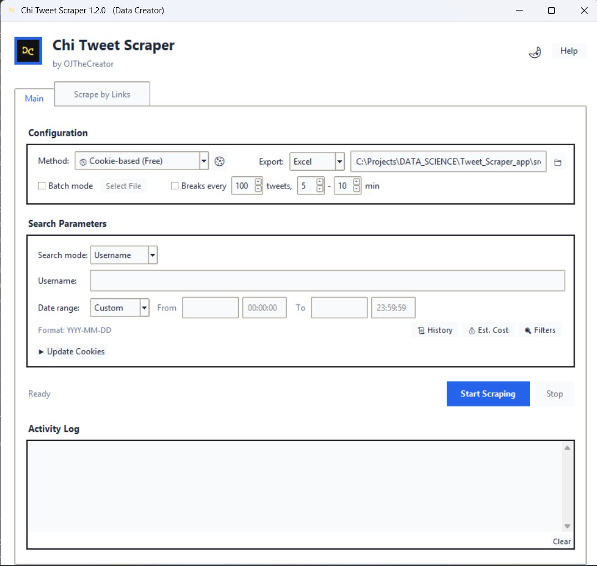
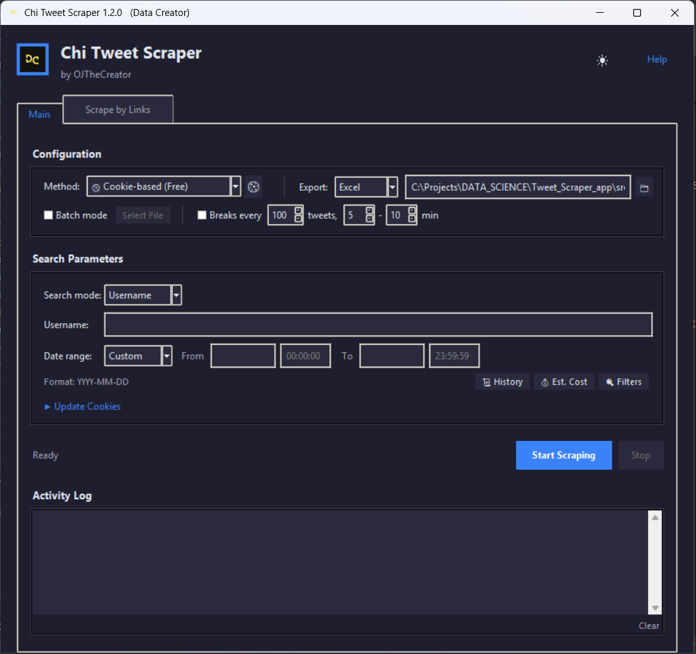

# Chi Tweet Scraper


Chi Tweet Scraper is a powerful desktop application built with **Python**, **Tkinter**, and **Twikit** that lets you scrape tweets by username or keywords within a chosen date range. It features both **free cookie-based** and **paid API-based** authentication, robust error recovery, dark mode, and exports results to multiple formats including **.xlsx**, **.csv**, **.json**, **.db**, **.html**, and **.md** files.

---

## ✨ Features

### Core Features

- **Intuitive GUI** — Clean, modern interface with dark mode support
- **Dual Authentication** — Free cookie-based OR paid API-based scraping
- **Username & Keyword Search** — Scrape by Twitter handle or search terms (AND/OR operators)
- **Date & Time Filtering** — Precise control with date presets and custom ranges
- **Batch Mode** — Scrape multiple usernames from a single .txt file
- **Link Scraping** — Extract data from specific tweet URLs (.txt or .xlsx input)
- **Multiple Export Formats** — Excel, CSV, JSON, SQLite, HTML, Markdown

### Reliability Features

- **Auto-Resume** — Progress saved every 25 tweets; resume interrupted sessions on restart
- **Smart Error Recovery** — Interactive dialogs for cookie expiry, network issues, and API errors
- **Rate Limit Prevention** — Configurable breaks (e.g., pause 5-10 min every 100 tweets)
- **Auto-Retry Logic** — Automatic retries with exponential backoff for transient errors
- **Engagement Filters** — Filter by minimum likes, retweets; exclude replies/RTs

### User Experience

- **🌙 Dark Mode** — Toggle between light and dark themes with live switching
- **📅 Date Presets** — Quick buttons for common date ranges (Last 7/30/90 days, etc.)
- **📊 Analytics** — View engagement stats after each scrape
- **📜 Scrape History** — Track all past scrapes with quick file access
- **💰 Cost Estimation** — See estimated API costs before scraping
- **📥 PDF Documentation** — Download comprehensive user guide

### Authentication Options

| Method | Cost | Best For |
|--------|------|----------|
| **Cookie-Based** | Free | Personal use, small scrapes |
| **API-Based (TwexAPI)** | $0.14/1k tweets | Large scrapes, reliability |

---

## 📸 Screenshots

| Light Mode | Dark Mode |
|------------|-----------|
|  |  |

---

## 🚀 What's New in v1.2.0

### Major New Features

- **🌙 Dark Mode** — Full dark theme with live switching (no restart needed)
- **🔑 API Integration** — TwexAPI support for reliable, high-volume scraping
- **📊 Multiple Export Formats** — Now supports 6 formats:
  - Excel (.xlsx) - Best for viewing and filtering
  - CSV (.csv) - Universal, fast for large datasets
  - JSON (.json) - For developers and APIs
  - SQLite (.db) - Database format for SQL queries
  - HTML (.html) - View in any browser
  - Markdown (.md) - For documentation
- **📅 Date Presets** — Quick selection buttons (Today, Last 7/30/90 days, This month, etc.)
- **🔍 Advanced Filters** — Minimum likes/retweets, exclude replies/RTs, media-only
- **💰 Cost Estimation** — See estimated costs before starting API scrapes
- **📜 Scrape History** — View and access all past scrapes
- **📊 Post-Scrape Analytics** — Engagement stats, top tweets, activity patterns

### Improved UI/UX

- **Compact Layout** — Cleaner interface with better organization
- **Live Theme Switching** — Dark mode applies instantly
- **Better Button Styling** — Proper hover states in both themes
- **Contact Links** — Easy access to support via WhatsApp, Twitter, GitHub

### Documentation

- **In-App PDF Download** — Comprehensive documentation available offline
- **Detailed Troubleshooting** — Solutions for common issues
- **Step-by-Step Guides** — For all features and authentication methods

See the full [CHANGELOG.md](CHANGELOG.md) for details.

---

## 📦 Installation

### Option 1: Windows Executable (Recommended)

1. Download the latest release from **[Releases](https://github.com/OJTheCreator/Chi-Tweet-Scraper/releases)**
2. Extract the .zip file to a folder of your choice
3. **⚠️ IMPORTANT:** Add the folder to your antivirus exclusions (see [Antivirus Guide](#-antivirus-notice))
4. Double-click `Chi Tweet Scraper.exe` to run

### Option 2: Python Installation

1. **Clone the repository:**

   ```bash
   git clone https://github.com/OJTheCreator/Chi-Tweet-Scraper.git
   cd Chi-Tweet-Scraper
   ```

2. **Create and activate a virtual environment:**

   ```bash
   # Windows
   python -m venv .venv
   .venv\Scripts\activate

   # Linux/Mac
   python3 -m venv .venv
   source .venv/bin/activate
   ```

3. **Install dependencies:**

   ```bash
   pip install -r requirements.txt
   ```

4. **Run the application:**

   ```bash
   python -m src.gui
   ```

---

## ⚠️ Antivirus Notice

The executable may be flagged by antivirus software — **this is a FALSE POSITIVE**.

**Why it's flagged:**
- Built with PyInstaller (used by both legitimate apps and malware)
- Makes network requests to Twitter/APIs
- Not digitally signed (costs $200-300/year)

**Windows Defender Fix:**
1. Open **Windows Security** → **Virus & threat protection**
2. Click **Manage settings** → scroll to **Exclusions**
3. Click **Add or remove exclusions** → **Add an exclusion** → **Folder**
4. Select the Chi Tweet Scraper folder

**Other Antivirus:** See the in-app Help or download the PDF documentation for specific instructions.

---

## 🎯 Usage

### Quick Start

1. **Launch the app**
2. **Choose your method:**
   - 🍪 **Cookie-based (Free):** Click the cookie button and paste cookies from Cookie-Editor
   - 🔑 **API-based (Paid):** Click the gear button and enter your TwexAPI key
3. **Enter search criteria:**
   - Username (e.g., `elonmusk`) OR
   - Keywords (e.g., `AI, machine learning`)
4. **Set date range** using presets or custom dates
5. **Click "Start Scraping"** and monitor progress

### Cookie Authentication (Free)

1. Install the [Cookie-Editor](https://cookie-editor.cgagnier.ca/) browser extension
2. Log in to Twitter/X.com in your browser
3. Click Cookie-Editor icon → **Export** → **Export as JSON**
4. In Chi Tweet Scraper, click 🍪 → paste cookies → **Save Cookies**

> ⚠️ Cookies expire every 1-2 weeks. Refresh when prompted.

### API Authentication (Paid)

1. Visit [TwexAPI.io](https://twexapi.io) and create an account
2. Purchase credits ($0.14 per 1,000 tweets)
3. Copy your API key
4. In Chi Tweet Scraper, select "TwexAPI" → click ⚙️ → paste key → **Test** → **Save**

### Batch Mode

1. Create a `.txt` file with usernames (one per line)
2. Check **"Batch mode"** and select your file
3. Each user's tweets are saved to separate files

### Scrape by Links

1. Switch to the **"Scrape by Links"** tab
2. Prepare a file with tweet URLs:
   - `.txt` with one URL per line, OR
   - `.xlsx` with URLs in column A
3. Select your file and click **"Start Link Scrape"**

### Rate Limit Prevention

For large scrapes (500+ tweets):
1. Enable **"Enable breaks"**
2. Set interval (e.g., every 100 tweets)
3. Set pause duration (e.g., 5-10 minutes)

---

## 📹 Video Tutorials

| Tutorial | Link |
|----------|------|
| Installation & Setup | [](https://youtu.be/RKX2sgQVgBg) |
| How to Use | [](https://youtu.be/AbdpX6QZLm4) |

---

## 🛠️ Building from Source

Create a portable executable:

```bash
python -m PyInstaller --onefile --noconsole \
    --name "ChiTweetScraper" \
    --icon="assets/logo.ico" \
    --add-data "assets/logo.png;assets" \
    --add-data "assets/logo.ico;assets" \
    --add-data "cookies;cookies" \
    --add-data "data;data" \
    --add-data "src;src" \
    --hidden-import=PIL \
    --hidden-import=openpyxl \
    --hidden-import=pandas \
    --hidden-import=twikit \
    --hidden-import=aiohttp \
    --hidden-import=httpx \
    src/gui.py
```

---

## 📁 Project Structure

```
Chi-Tweet-Scraper/
├── src/
│   ├── gui.py              # Main application (GUI)
│   ├── scraper.py          # Core scraping logic
│   ├── state_manager.py    # Session persistence
│   ├── create_cookie.py    # Cookie processing
│   ├── api/                # API integrations
│   │   ├── base.py         # Base API scraper class
│   │   ├── tweetx_api.py   # TwexAPI implementation
│   │   └── registry.py     # API provider registry
│   ├── config/             # Configuration management
│   │   └── api_keys.py     # API key storage
│   └── utils/              # Utility modules
│       └── features.py     # Export formats, retry logic
├── assets/
│   ├── logo.png            # App logo
│   └── logo.ico            # Window icon
├── config/
│   └── api_keys.example.json
├── data/
│   ├── exports/            # Output directory
│   └── app_settings.json   # User preferences
├── cookies/                # Cookie storage
├── requirements.txt
├── CHANGELOG.md
└── README.md
```

---

## 🔧 Tech Stack

- **Python 3.10+**
- **Tkinter** — Cross-platform GUI with ttk widgets
- **[Twikit](https://github.com/d60/twikit)** — Twitter/X API wrapper
- **Pandas** — Data processing and export
- **OpenPyXL** — Excel file generation
- **Pillow** — Image processing
- **HTTPX** — Async HTTP client
- **ReportLab** — PDF generation (optional)

---

## 🤝 Contributing

Contributions are welcome! Please:

1. Fork the repository
2. Create a feature branch (`git checkout -b feature/amazing-feature`)
3. Commit your changes (`git commit -m 'Add amazing feature'`)
4. Push to the branch (`git push origin feature/amazing-feature`)
5. Open a Pull Request

---

## 📬 Connect & Support

### Contact

| Platform | Link |
|----------|------|
| **WhatsApp** | [Chat with OJ](https://wa.me/2348088666352) |
| **Twitter/X** | [@datacreatorhub](https://twitter.com/datacreatorhub) |
| **GitHub** | [@OJTheCreator](https://github.com/OJTheCreator) |
| **Email** | [Datacreatorhub@gmail.com](mailto:Datacreatorhub@gmail.com) |

### Support the Project

If you find Chi Tweet Scraper useful, consider supporting its development:

| Method | Address |
|--------|---------|
| **Bitcoin (BTC)** | `bc1qut300lc2e42jsxu7aut8phafq2h5xvwq0dn3ma` |

Your support helps maintain and improve the project! ❤️

---

## 📄 License

This project is open source and available under the [MIT License](LICENSE).

---

<p align="center">
  <strong>Made with ❤️ by OJ (Data Creator)</strong><br>
  <a href="https://twitter.com/datacreatorhub">Twitter</a> •
  <a href="https://github.com/OJTheCreator">GitHub</a> •
  <a href="https://wa.me/2348088666352">WhatsApp</a>
</p>
