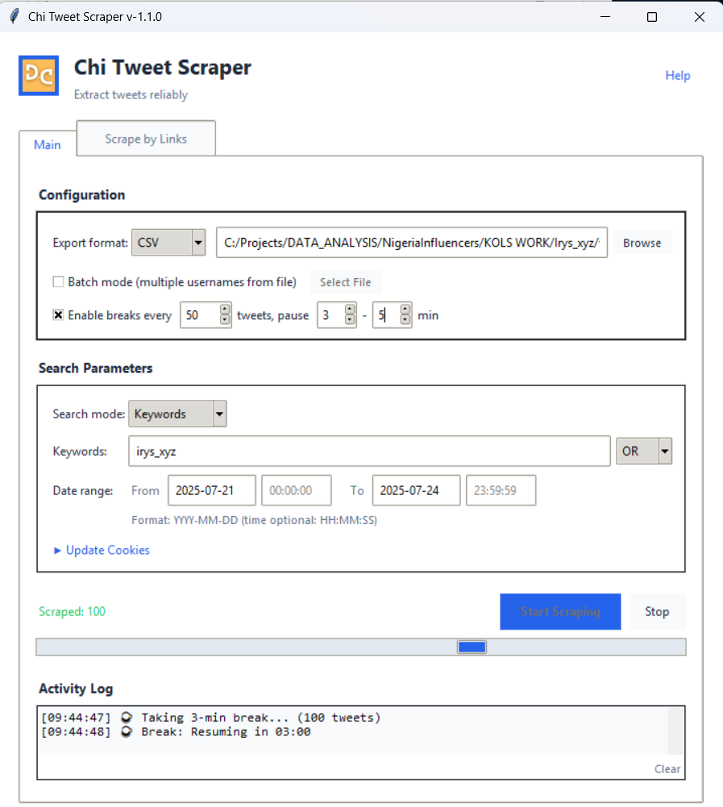

# Chi Tweet Scraper


Chi Tweet Scraper is a powerful desktop application built with **Python**, **Tkinter**, and **Twikit** that lets you scrape tweets by username or keywords within a chosen date range. It features cookie-based authentication, robust error recovery, and exports results to **.xlsx** or **.csv** files.

---

## ✨ Features

### Core Features

- **Intuitive GUI** — Clean, modern interface with easy-to-use controls
- **Username & Keyword Search** — Scrape by Twitter handle or search terms (AND/OR operators)
- **Date & Time Filtering** — Precise control with YYYY-MM-DD dates and optional HH:MM:SS times
- **Batch Mode** — Scrape multiple usernames from a single .txt file
- **Link Scraping** — Extract data from specific tweet URLs (.txt or .xlsx input)
- **Flexible Export** — Save as Excel (.xlsx) or CSV files

### Reliability Features

- **Auto-Resume** — Progress saved every 25 tweets; resume interrupted sessions on restart
- **Smart Error Recovery** — Interactive dialogs for cookie expiry, network issues, and API errors
- **Rate Limit Prevention** — Configurable breaks (e.g., pause 5-10 min every 100 tweets)
- **Retry Logic** — Automatic retries with progressive backoff for transient errors

### Authentication

- **Cookie-Based Login** — Paste cookies from Cookie-Editor extension; no passwords stored
- **Expiration Detection** — Prompted to refresh cookies when they expire mid-scrape

---

## 📸 Screenshots

| v1.0.0 | v1.1.0 |
|--------|--------|
|  |  |

---

## 🚀 What's New in v1.1.0

### New Features

- **Keyword Search Mode** — Search tweets by keywords with AND/OR operators
- **Time Filtering** — Filter by specific hours (HH:MM:SS), not just dates
- **Batch Mode** — Process multiple usernames from a file in one session
- **Scrape by Links Tab** — New tab to scrape specific tweets from URL lists
- **Configurable Breaks** — Set automatic pauses to avoid rate limits
- **Auto-Resume** — Automatically resume interrupted scrapes on app restart

### Improved UI

- **Compact Layout** — Fits better on smaller screens (680×620 default)
- **Tabbed Interface** — Separate tabs for search scraping and link scraping
- **Collapsible Sections** — Cookie input hidden by default, expandable when needed
- **Real-time Progress** — Live tweet count displayed during scraping
- **Activity Log** — Always-visible log with clear button

### Error Handling

- **Interactive Recovery Dialogs** — Choose to retry, update cookies, or stop & save
- **Network Testing** — Test connection before resuming after network errors
- **Progress Preservation** — Never lose scraped data, even on errors

### Quality of Life

- **State Management** — Resume incomplete sessions after closing the app
- **Improved Help Guide** — Comprehensive in-app documentation
- **YouTube Tutorial Links** — Quick access to video guides

See the full [CHANGELOG.md](CHANGELOG.md) for details.

---

## 📦 Installation

### Option 1: Python Installation

1. **Clone the repository:**

   ```bash
   git clone https://github.com/OJTheCreator/Chi-Tweet-Scraper.git
   cd Chi-Tweet-Scraper
   ```

2. **Create and activate a virtual environment:**

   ```bash
   # Windows
   python -m venv .venv
   .venv\Scripts\activate

   # Linux/Mac
   python3 -m venv .venv
   source .venv/bin/activate
   ```

3. **Install dependencies:**

   ```bash
   pip install -r requirements.txt
   ```

### Option 2: Portable Executable

Download the pre-compiled `.exe` from the **[Releases](https://github.com/OJTheCreator/Chi-Tweet-Scraper/releases)** page.

> ⚠️ **Note:** Some antivirus software may flag the `.exe` as a false positive. You may need to add an exclusion.

---

## 🎯 Usage

### Quick Start

1. **Launch the app:**

   ```bash
   python GUI.py
   # or
   python -m src.gui
   ```

2. **Set up cookies:**
   - Install the [Cookie-Editor](https://cookie-editor.cgagnier.ca/) browser extension
   - Log in to Twitter/X.com
   - Click Cookie-Editor → Export as JSON
   - In the app, click "▶ Update Cookies" and paste

3. **Configure your scrape:**
   - Choose **Username** or **Keywords** mode
   - Enter target username or search terms
   - Set date range (and optional time range)
   - Select export format (Excel/CSV)

4. **Start scraping:**
   - Click **"Start Scraping"**
   - Monitor progress in the Activity Log
   - Files are saved to `/data/exports`

### Batch Mode

1. Create a `.txt` file with usernames (one per line or comma-separated)
2. Check "Batch mode" and select your file
3. Each user's tweets are saved to separate files

### Scrape by Links

1. Switch to the **"Scrape by Links"** tab
2. Prepare a `.txt` file with tweet URLs (one per line) or `.xlsx` with URLs in column A
3. Select your file and click **"Start Link Scrape"**

### Rate Limit Prevention

For large scrapes (500+ tweets):

1. Enable "Enable breaks every X tweets"
2. Set interval (e.g., 100 tweets)
3. Set pause duration (e.g., 5-10 minutes)

---

## 📹 Video Tutorials

| Tutorial | Link |
|----------|------|
| Installation & Setup | [](https://youtu.be/RKX2sgQVgBg) |
| How to Use | [](https://youtu.be/AbdpX6QZLm4) |

---

## 🛠️ Building from Source

Create a portable executable:

```bash
python -m PyInstaller --onefile --noconsole --name "ChiTweetScraper" --icon="assets/logo.ico" --add-data "assets/logo.png;assets" --add-data "assets/logo.ico;assets" --add-data "cookies;cookies" --add-data "data;data" --add-data "src/scraper.py;src" --add-data "src/state_manager.py;src" --add-data "src/create_cookie.py;src" --hidden-import=PIL --hidden-import=openpyxl --hidden-import=pandas --hidden-import=twikit --hidden-import=aiohttp src/gui.py
```

---

## 📁 Project Structure

```
Chi-Tweet-Scraper/
├── src/
│   ├── scraper.py          # Core scraping logic
│   ├── state_manager.py    # Session persistence
│   ├── create_cookie.py    # Cookie processing
│   └── GUI.py              # Main application entry point
├── assets/
│   ├── logo.png            # App logo
│   └── logo.ico            # Window icon
├── data/
│   └── exports/            # Output directory
├── cookies/                # Cookie storage
├── requirements.txt
├── CHANGELOG.md
└── README.md
```

---

## 🔧 Tech Stack

- **Python 3.10+**
- **Tkinter** — Cross-platform GUI
- **[Twikit](https://github.com/d60/twikit)** — Twitter/X API wrapper
- **OpenPyXL** — Excel file generation
- **Pillow** — Image processing for logo

---

## 🤝 Contributing

Contributions are welcome! Please:

1. Fork the repository
2. Create a feature branch (`git checkout -b feature/amazing-feature`)
3. Commit your changes (`git commit -m 'Add amazing feature'`)
4. Push to the branch (`git push origin feature/amazing-feature`)
5. Open a Pull Request

---

## 📬 Connect

- **Email:** [Datacreatorhub@gmail.com](mailto:Datacreatorhub@gmail.com)
- **GitHub:** [@OJTheCreator](https://github.com/OJTheCreator)

---

## 📄 License

This project is open source and available under the [MIT License](LICENSE).

---

<p align="center">Made with ❤️ by OJ</p>
